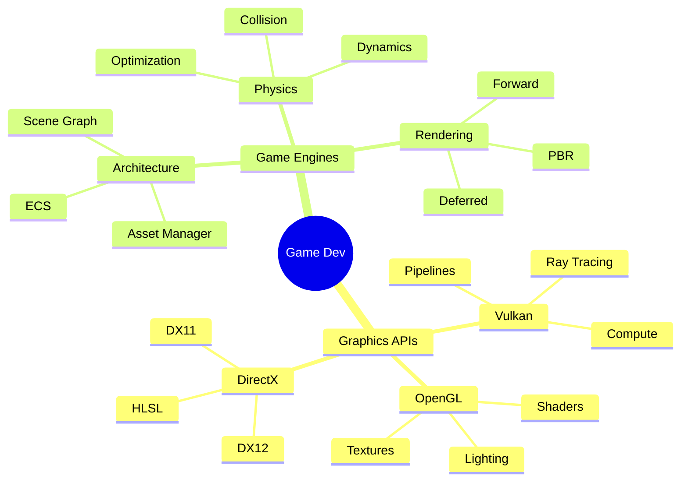

<div align="center">

# 🎮 HOBBY PROJECTS

### *Turning Ideas Into Interactive Reality*


---


[](https://github.com/HobyProjects)
[](https://github.com/HobyProjects)
[](https://github.com/HobyProjects)

</div>

---

## 🚀 ABOUT_ME.cpp

```cpp
class Developer {
private:
    string name = "HobyProjects";
    string role = "Game Engine Developer";
    string location = "Sri Lanka 🇱🇰";
    
public:
    vector<string> languages = {"C", "C++", "C#", "Java"};
    vector<string> graphics_apis = {"OpenGL", "Vulkan", "DirectX"};
    vector<string> focus_areas = {
        "🎮 Game Engine Architecture",
        "🖼️ Real-time Graphics Programming", 
        "⚡ Performance Optimization",
        "🔧 Low-level System Programming"
    };
    
    void current_mission() {
        cout << "⚡ Building game engines from scratch\n";
        cout << "🎨 Mastering graphics APIs\n";
        cout << "🔬 Exploring physics simulations\n";
        cout << "🚀 Pushing performance boundaries\n";
    }
    
    string get_motto() {
        return "Code -> Compile -> Create -> Conquer";
    }
};
```

<div align="center">

### 💭 *"Delving into game engines | Familiar with OpenGL, Vulkan, and DirectX APIs"*

</div>

---

## ⚡ TECH_STACK

<div align="center">

### 🔥 Core Languages


### 🎮 Graphics & Game Development  


### 🌐 Web Technologies


### 🛠️ Tools & Platforms


</div>

---

## 📂 FEATURED_PROJECTS

<div align="center">

<table>
<tr>
<td width="50%" valign="top">

### 🎯 [Motion](https://github.com/HobyProjects/Motion)

**Physics & Animation Engine**

```yaml
Description: C-based motion simulation system
Status: ⭐ 1 Star | 🔄 Active
Tech: C, Physics Simulation
Features:
  - Physics engine implementation
  - Animation frameworks
  - Real-time simulation
```


</td>
<td width="50%" valign="top">

### 🎲 [SMAD](https://github.com/HobyProjects/SMAD)

**Game Development Project**

```yaml
Description: Java-based game project
Status: 🔄 Recently Updated
Tech: Java, Game Logic
Features:
  - Object-oriented design
  - Game mechanics
  - Entity systems
```


</td>
</tr>

<tr>
<td width="50%" valign="top">

### 🖥️ [HPC](https://github.com/HobyProjects/HPC)

**High Performance Computing**

```yaml
Description: C++ optimization project
Status: 🔄 Active Development
Tech: C++, Performance
Features:
  - Performance optimization
  - Multi-threading
  - Memory management
```


</td>
<td width="50%" valign="top">

### 🖼️ [img](https://github.com/HobyProjects/img)

**Image Processing Library**

```yaml
Description: Image manipulation library
Status: 📦 MIT License
Tech: C++, Image Processing
Features:
  - Image manipulation
  - Filter algorithms
  - Format conversion
```


</td>
</tr>

<tr>
<td width="50%" valign="top">

### 💙 [BlueScreen](https://github.com/HobyProjects/BlueScreen)

**System Simulation Tool**

```yaml
Description: System crash simulator
Status: 🎭 Fun Project
Tech: C#, WinForms
Features:
  - Crash screen simulation
  - Windows API integration
  - Educational tool
```


</td>
<td width="50%" valign="top">

### 🔍 [Explore More →](https://github.com/HobyProjects?tab=repositories)

```yaml
Total Repositories: 6
Public Projects: 5
Languages: C, C++, C#, Java
Focus: Game Engines & Graphics
```

**🌟 More projects coming soon!**

</td>
</tr>
</table>

</div>

---

## 📊 GITHUB_STATS

<div align="center">


</div>

---

## 🎯 CURRENT_FOCUS

<div align="center">



</div>

### 🔥 What I'm Building

<div align="center">

| Area | Focus | Status |
|------|-------|--------|
| 🎮 **Game Engines** | Custom engine architecture | 🔨 In Progress |
| 🖼️ **Graphics Programming** | Modern rendering techniques | 🚀 Active |
| ⚡ **Performance** | Optimization & profiling | 📈 Learning |
| 🎨 **Shaders** | Advanced shader effects | 💡 Exploring |
| 🔧 **Tools** | Development tooling | 🛠️ Building |

</div>

---

## 🏗️ GAME_ENGINE_ARCHITECTURE

<div align="center">

```ascii
╔═══════════════════════════════════════════════════════════════╗
║                     🎮 GAME ENGINE CORE                       ║
╠═══════════════════════════════════════════════════════════════╣
║                                                               ║
║  ┌─────────────┐    ┌─────────────┐    ┌─────────────┐     ║
║  │  RENDERER   │    │   PHYSICS   │    │    AUDIO    │     ║
║  │ ┌─────────┐ │    │ ┌─────────┐ │    │ ┌─────────┐ │     ║
║  │ │ OpenGL  │ │    │ │Collision│ │    │ │3D Sound │ │     ║
║  │ │ Vulkan  │ │◄───┤ │Dynamics │ │◄───┤ │Spatial  │ │     ║
║  │ │ DirectX │ │    │ │Raycast  │ │    │ │Mixer    │ │     ║
║  │ └─────────┘ │    │ └─────────┘ │    │ └─────────┘ │     ║
║  └──────┬──────┘    └──────┬──────┘    └──────┬──────┘     ║
║         │                  │                  │             ║
║         └──────────────────┴──────────────────┘             ║
║                            │                                 ║
║                   ┌────────▼────────┐                       ║
║                   │  ENTITY SYSTEM  │                       ║
║                   │ ┌──────────────┐│                       ║
║                   │ │  Components  ││                       ║
║                   │ │  Transforms  ││                       ║
║                   │ │ Hierarchies  ││                       ║
║                   │ └──────────────┘│                       ║
║                   └────────┬────────┘                       ║
║         ┌──────────────────┼──────────────────┐            ║
║         │                  │                  │             ║
║  ┌──────▼──────┐    ┌──────▼──────┐    ┌──────▼──────┐   ║
║  │    INPUT    │    │  SCRIPTING  │    │  RESOURCES  │   ║
║  │ ┌─────────┐ │    │ ┌─────────┐ │    │ ┌─────────┐ │   ║
║  │ │Keyboard │ │    │ │ C++/Lua │ │    │ │ Assets  │ │   ║
║  │ │  Mouse  │ │    │ │ Events  │ │    │ │ Shaders │ │   ║
║  │ │ Gamepad │ │    │ │Behavior │ │    │ │Textures │ │   ║
║  │ └─────────┘ │    │ └─────────┘ │    │ └─────────┘ │   ║
║  └─────────────┘    └─────────────┘    └─────────────┘   ║
║                                                               ║
╚═══════════════════════════════════════════════════════════════╝
```

</div>

---

## 🔥 3D_GRAPHICS_PIPELINE

<div align="center">

```ascii
┌──────────────┐
│ Vertex Data  │
└──────┬───────┘
       │
       ▼
┌──────────────┐     ╔══════════════════╗
│Vertex Shader │────►║ Vertex Transform ║
└──────┬───────┘     ║ Position Calc    ║
       │             ╚══════════════════╝
       ▼
┌──────────────┐     ╔══════════════════╗
│Tessellation  │────►║ Geometry Detail  ║
└──────┬───────┘     ║ Surface Smooth   ║
       │             ╚══════════════════╝
       ▼
┌──────────────┐     ╔══════════════════╗
│Geometry Shader────►║ Primitive Gen    ║
└──────┬───────┘     ║ Instancing       ║
       │             ╚══════════════════╝
       ▼
┌──────────────┐     ╔══════════════════╗
│Rasterization │────►║ Pixel Coverage   ║
└──────┬───────┘     ║ Interpolation    ║
       │             ╚══════════════════╝
       ▼
┌──────────────┐     ╔══════════════════╗
│Fragment Shader────►║ Pixel Color      ║
└──────┬───────┘     ║ Lighting/Texture ║
       │             ╚══════════════════╝
       ▼
┌──────────────┐     ╔══════════════════╗
│Per-Fragment  │────►║ Depth Test       ║
│Operations    │     ║ Stencil Test     ║
└──────┬───────┘     ║ Blending         ║
       │             ╚══════════════════╝
       ▼
┌──────────────┐
│ Frame Buffer │
└──────┬───────┘
       │
       ▼
  📺 DISPLAY
```

</div>

---

## 🌐 CONNECT_WITH_ME

<div align="center">

<a href="https://github.com/HobyProjects">
  
</a>
<a href="mailto:isuruudayanga332@gmail.com">
  
</a>
<a href="https://www.linkedin.com/in/isuru-udayanga">
  
</a>

---

### 💬 Let's Collaborate!


</div>

---

## 💡 PHILOSOPHY

<div align="center">

> ### *"The best way to predict the future is to implement it."*
> **— Alan Kay**

<br>

```cpp
if (passion == true && dedication == true) {
    success = buildGameEngine();
    cout << "🎮 Game Development is not just about playing games" << endl;
    cout << "    It's about creating worlds! 🌍" << endl;
}
```

<br>

### 🚀 *Let's Build Something Amazing Together!*

<br>


</div>

---

<div align="center">

**⭐ From [HobyProjects](https://github.com/HobyProjects)** | **#IndieDev #CPlusPlus #GameEngines**


*Last Updated: 2024*

</div>
