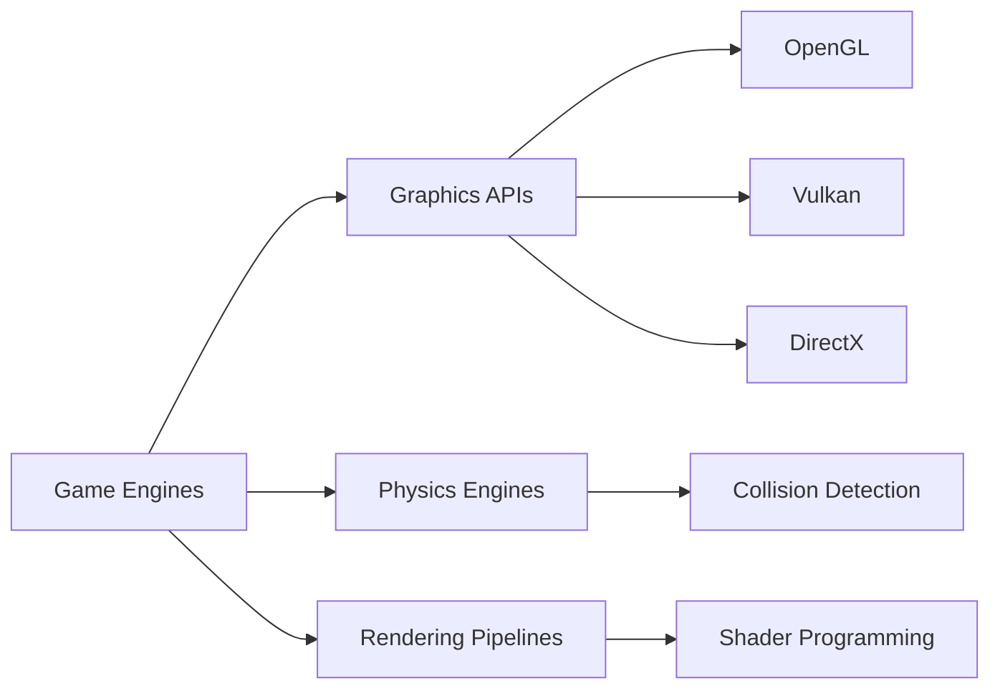

# 🎮 HOBBY PROJECTS
### *Turning Ideas Into Interactive Reality*

```ascii
 ██╗  ██╗ ██████╗ ██████╗ ██████╗ ██╗   ██╗
 ██║  ██║██╔═══██╗██╔══██╗██╔══██╗╚██╗ ██╔╝
 ███████║██║   ██║██████╔╝██████╔╝ ╚████╔╝ 
 ██╔══██║██║   ██║██╔══██╗██╔══██╗  ╚██╔╝  
 ██║  ██║╚██████╔╝██████╔╝██║  ██║   ██║   
 ╚═╝  ╚═╝ ╚═════╝ ╚═════╝ ╚═╝  ╚═╝   ╚═╝   
                                            
    P R O J E C T S
```

<div align="center">


[](https://github.com/HobyProjects)
[](https://github.com/HobyProjects)

</div>

---

## 🚀 About Me

> **Game Development Enthusiast** | **C/C++ Programmer** | **Graphics API Explorer**

I'm passionate about **delving into game engines** and building interactive experiences from the ground up. My journey involves exploring the depths of graphics programming with **OpenGL**, **Vulkan**, and **DirectX APIs**, while mastering the art of game development.

```cpp
class Developer {
    public:
        string name = "HobyProjects";
        string focus = "Game Engine Development";
        vector<string> languages = {"C", "C++", "C#", "Java"};
        vector<string> expertise = {"OpenGL", "Vulkan", "DirectX", "Game Engines"};
        
        void currentWork() {
            cout << "🔨 Building game engines from scratch" << endl;
            cout << "🎨 Exploring graphics programming" << endl;
            cout << "⚡ Optimizing real-time rendering" << endl;
        }
};
```

---

## 🛠️ Tech Arsenal

### **Core Languages**


### **Graphics & Game Development**


### **Web Technologies**


### **Tools & Platforms**


---

## 💼 Featured Projects

<table>
<tr>
<td width="50%">

### 🎯 [Motion](https://github.com/HobyProjects/Motion)
**Physics & Animation Engine**

A C-based motion simulation system exploring physics engines and animation frameworks.

`⭐ 1 stars` • `Updated: 10 hours ago`

**Tech:** C, Physics Simulation

</td>
<td width="50%">

### 🎲 [SMAD](https://github.com/HobyProjects/SMAD)
**Game Development Project**

Java-based game development project showcasing object-oriented game design principles.

`Updated: last month`

**Tech:** Java, Game Logic

</td>
</tr>

<tr>
<td width="50%">

### 🖥️ [HPC](https://github.com/HobyProjects/HPC)
**High Performance Computing**

C++ project focusing on optimization and high-performance computing techniques.

`Updated: Oct 23`

**Tech:** C++, Performance Optimization

</td>
<td width="50%">

### 🖼️ [img](https://github.com/HobyProjects/img)
**Image Processing Library**

Image manipulation and processing library with MIT License.

`Updated: Apr 25`

**Tech:** C++, Image Processing

</td>
</tr>

<tr>
<td width="50%">

### 💙 [BlueScreen](https://github.com/HobyProjects/BlueScreen)
**System Debugging Tool** 🔒

*"Fool your friend with crashed screen"*

A fun C# project simulating system errors.

`Updated: May 17, 2024`

**Tech:** C#, WinForms

</td>
<td width="50%">

### 🌟 [More Projects](https://github.com/HobyProjects?tab=repositories)

Explore all 5 public repositories showcasing various aspects of game development, graphics programming, and software engineering.

</td>
</tr>
</table>

---

## 📊 GitHub Analytics

<div align="center">
  


</div>

---

## 🎯 Current Focus



### 🔥 What I'm Working On

- 🎮 **Building custom game engines** from the ground up
- 🖼️ **Exploring advanced graphics techniques** with modern APIs
- ⚡ **Optimizing real-time rendering** for performance
- 🎨 **Implementing shader effects** and visual enhancements
- 🔧 **Learning engine architecture** and design patterns

---

## 🌐 Connect With Me

<div align="center">

[](https://github.com/HobyProjects)
[](mailto:isuruudayanga332@gmail.com)
[](https://www.linkedin.com/in/isuru-udayanga)

</div>

---

## 💡 Philosophy

<div align="center">

> *"The best way to predict the future is to implement it."*
> 
> **— Alan Kay**

```
 ╔══════════════════════════════════════════╗
 ║  🎮  Game Development is not just       ║
 ║      about playing games—                ║
 ║      it's about creating worlds.     🌍  ║
 ╚══════════════════════════════════════════╝
```

### 🚀 Let's Build Something Amazing Together!

</div>

---

<div align="center">

### 📈 Contribution Graph


---


---

**⭐ From [HobyProjects](https://github.com/HobyProjects)** | **#IndieDev #CPlusPlus**

*Last Updated: 2024*

</div>
